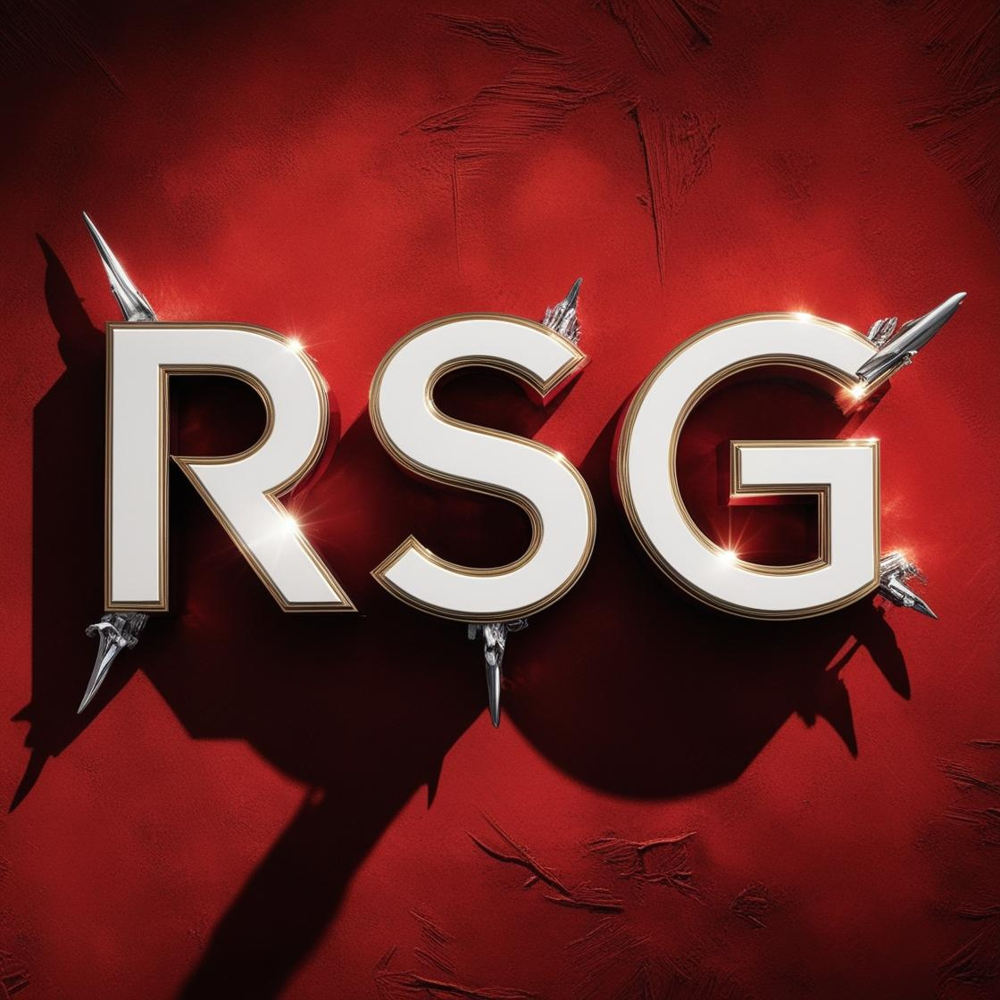

## Getting Started with RSG Framework

Information on getting started with **RSG Framework** and **Lua Practices**

<CardGroup cols="2">
  <Card title="Installation" icon="pen-to-square" color="#CA0606" href="https://quantumprojects.mintlify.app/essentials/installation">
    ### Check how to Windows Install RSG Framework Correctly
  </Card>

  <Card title="RSG Github" icon="github" color="#CA0606" href="https://github.com/Rexshack-RedM">
    Check out the Official RSG Framework github for updates and more!&#x20;
  </Card>

  <Card title="Native Research" icon="github" color="#CA0606" href="https://quantumprojects.mintlify.app/development#native-research-sites-tools">
    Check out some RedM Native Tools!&#x20;
  </Card>
</CardGroup>

### Credits

* **QB Core** Team for a lot of info

* **Ox Lib** Team for menu, notifications etc.

* **RexShack** for his awesome work on maintaining **RSG**