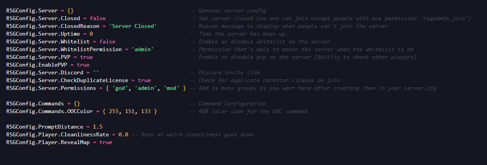

***

<Accordion title="Ace Permissions?" defaultOpen={false} icon="shield">
  Aces are the built-in permissions system provided by CFX. They allow for creating new nodes which have aces attached to them. This permission system consists of aces & principals. Essentially think of a tree with branches. We have our ace that we create and then each branch would be our principal which inherits the permissions of our ace
</Accordion>

<Check>
  txAdmin should automatically set the server owner as the highest permission level
</Check>

## Server Config

Learn how to update your docs locally and deploy them to the public.

### Edit and preview

* At the bottom of your server.cfg file you will see a permissions section

```lua
## Permissions ##
add_ace group.admin command allow # allow all commands
add_principal identifier.license:XXXXXXXXXXXXXXX rsgcore.god # << your rockstar licence  
add_principal identifier.license:XXXXXXXXXXXXXXX group.admin # << your rockstar licence

# Resources
add_ace resource.rsg-core command allow # Allow rsg-core to execute commands

# Gods
add_ace rsgcore.god command allow # Allow all commands

# Inheritance
add_principal rsgcore.god group.admin # Allow gods access to the main admin group used to get all default permissions
add_principal rsgcore.god rsgcore.admin # Allow gods access to admin commands
add_principal rsgcore.admin rsgcore.mod # Allow admins access to mod commands

```

## Different types of identifiers

* **FiveM ID**

* **Rockstar license (what rsgcore uses)**

* **Discord ID**

To get a RedM or Red Dead 2 license you can look up the player on your txAdmin web panel


**If they are currently connected to the server, you will get all available identifiers**

### After gathering the desired identifiers, go to your server.cfg and add the `Players` section as shown below

<Info>
  rsgcore.god and group.admin share the same permissions you can use either one.
</Info>

## Setting users permissions in the server

While you have permissions you can set users permissions either using commands or the admin menu

<AccordionGroup>
  <Accordion title="Setting permissions using the command" defaultOpen={false}>
    * While in the server type in the command `/addpermission [id] [addpermissions]`

    * It will look something like this `/addpermission 1 god`
  </Accordion>

  <Accordion title="Setting permissions through the admin menu" defaultOpen={false}>
    * In chat enter the command `/admin`

    * Access the "Player Management" tab and select the player you want to give permissions to

    * Locate a menu item called "Permissions"

    * Set the user group for that user then press "submit"
  </Accordion>
</AccordionGroup>

## Allowing commands to specific permissions

In rsg-core/config.lua find **`RSGConfig.Server.Permissions = {'god', 'admin', 'mod'}`**



Here you can add more groups, lets say I wanted to make one for police I would have `RSGConfig.Server.Permissions = {'god', 'admin', 'mod', 'law'}`

Making a command for only leo can access would look like

```
RSGCore.Commands.Add('cuff', 'Cuff Player', {}, false, function(source)
-- Run code
end, 'law')
```

So now when you add this command using the qbcore function it will automatically generate an ace called rsgcore.law with an ace of command.cuff! Now you can add a principal of a player with `add_principal identifier.license:xxxx rsgcore.law` and now that command will be restricted to only those with that permission as well as remove the chat suggestion for anyone without this permission! Imagine if you used this when setting a players job or when a player clocked in/out to dynamically remove the permission. This also completely eliminates the need to ever check job permissions on a command like this because the command itself will already be restricted